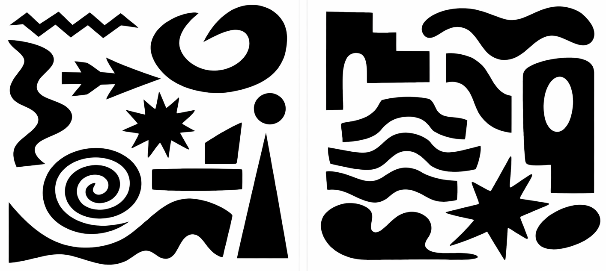
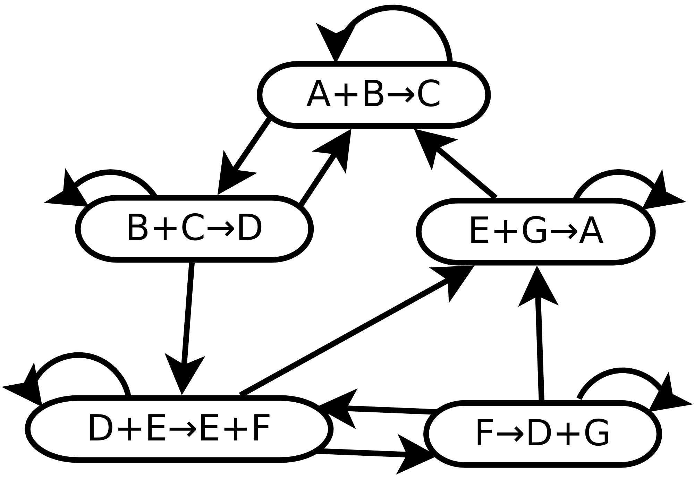
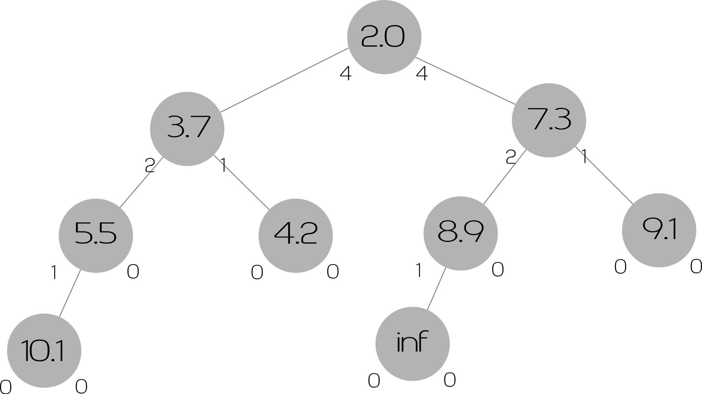
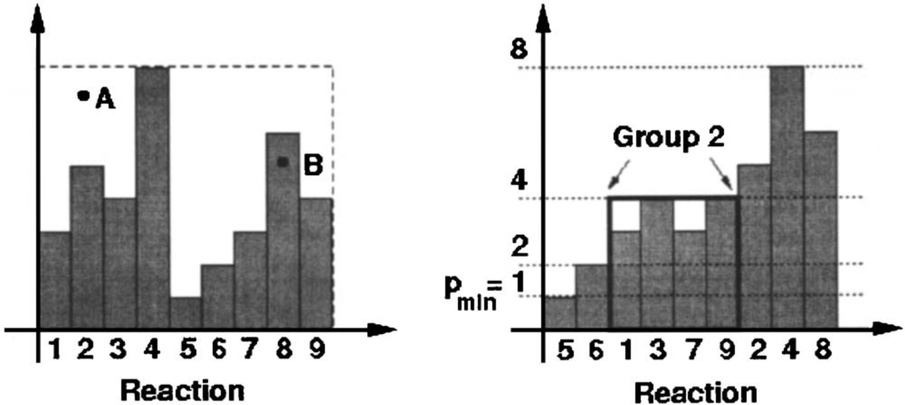
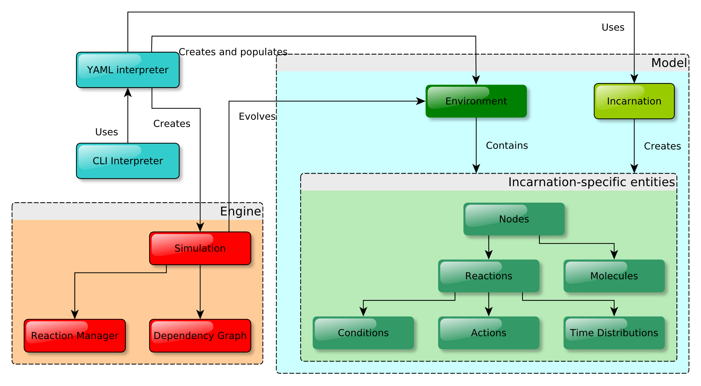

+++

title = "MICRO-MACRO COMPUTATIONAL MODELS: THEORY, APPLICATIONS AND EMERGENT PROPERTIES"
description = "Module 2"
outputs = ["Reveal"]
aliases = [
    "/guide/"
]

+++


# MICRO-MACRO COMPUTATIONAL MODELS: THEORY, APPLICATIONS AND EMERGENT PROPERTIES
## Module 2

## [Danilo Pianini](mailto:danilo.pianini@unibo.it) - {}

---

# Part 1: Nature-inspired systems and emergence

---



---

<video width="120%" height="120%" autoplay controls loop><source data-src="https://danysk.github.io/Slides-2019-OYM/video/stampede.mp4" type="video/webm" /></video>

---

## Context: large-scale open systems

Typical setting:
- Networked systems with many participants
- Heterogeneous devices (capabilities, energy, sensors/actuators)
- Partial knowledge, unreliable communication
- Dynamic topology (mobility, churn)
- Situatedness: space and time matter
- No stable coordinator

---

## Engineering problem: Collective Adaptive Systems (CASs)

We want systems that are:
- Distributed and scalable
- Adaptive to changes (environment, participants, goals)
- Robust to failures and uncertainty
- Maintainable and evolvable over time

Key question:
> How do we engineer global behavior from local components?

---

## The “obvious” approach: centralize

Pipeline:
1. Gather data to a central point
2. Compute decisions centrally
3. Push actions back to devices

Typical issues:
- Single point of failure
- Scalability bottleneck
- High latency (worse at high density)
- Privacy and governance concerns
- Inefficient use of network/computation at the edge

---

## So… decentralize?

{}
{}
- **No single coordinator**
- **Local interactions only**
- **No global state**
- **No single control loop**
- Local interactions must produce coherent global behavior

> How do we design these systems reliably?

{}
{}
<video width="50%" height="100%" autoplay controls loop><source data-src="video/mantis-hornet.mp4" type="video/webm" /></video>
{}
{}

---

## What “no coordinator” implies

Constraints that shape the engineering:
- No global state
- No single control loop
- Local interactions only (limited range, limited bandwidth)
- Faults are normal (dropouts, delays, partitions)
- The system must still behave coherently at the macro level

---

## Nature inspiration (general)

**Bio-inspired design** as engineering transfer:
- Identify a function that nature performs well
- Abstract the mechanism (not the biological details)
- Re-implement under engineering constraints
- Validate against measurable requirements

---



---




---



---



---

## Gecko-inspired dry adhesion

{}
{}


- Function-driven design (adhesion without glue)
- Mechanism abstraction (micro-/nano-structures to increase contact)
- Engineering outcome (reusable, scalable dry adhesives)
{}
{}


{}
{}

---



---

## Shinkansen series 500

- Tunnel boom: sonic boom-like noise when exiting tunnels at high speed
- Caused by buildup and rapid release of pressure waves
- Constraints: need to maintain high speed and passenger comfort

> What can we learn from nature to solve this?

---



---



---



---

## Shinkansen series 700

- Solution: geometry inspired by kingfisher beak
- Outcome: reduced noise, improved aerodynamics

---

## Back to CAS: what nature can teach

For collective adaptive systems we look for:
- Leaderless coordination
- Local sensing + local communication
- Feedback loops and self-regulation
- Robustness through redundancy and adaptation

Core idea:
> Local rules can produce macroscopic structure.

---

## Self-organising systems

One way to tackle these challenges is through systems that **self-organise**.

* *Self-organisation* is a process in which a system spontaneously organizes itself into a structured state without external control.
* It is a **bottom-up** process in which local interactions among components lead to the **emergence** of global patterns or structures.
* Self-organisation is often observed in *natural systems*, such as biological organisms, ecosystems, and social systems.
* It can also be applied to artificial systems, such as robotics, distributed computing, and complex networks.

---

<div id="div1" style="width: 720px; float: left; overflow: hidden;">
  
</div>
<div id="div2" style="width: 720px; float: left; overflow: hidden;">
  
</div>
<div id="div3" style="width: 720px; float: left; overflow: hidden;">
  
</div>
<div id="div4" style="width: 720px; float: left; overflow: hidden;">
  
</div>

---

<iframe
width="1920" height="950"
src="https://www.youtube.com/embed/ZHpu7ngQxwE?si=YPGltxUIp5QtcOlV"
autoplay="true"
title="YouTube video player"
frameborder="0"
allow="accelerometer; autoplay; clipboard-write; encrypted-media; gyroscope; picture-in-picture; web-share"
referrerpolicy="strict-origin-when-cross-origin"
allowfullscreen>
</iframe>

---

<iframe
src="https://www.netlogoweb.org/launch#https://www.netlogoweb.org/assets/modelslib/Sample%20Models/Biology/Ants.nlogo"
style="position: relative; top: 0; left: 0; width: 100%; height: 28em;">
</iframe>

---

# Part 2: Simulation paradigms and modeling choices

---

## Why simulation for *CAS*

Simulation is the practical way to:
- test hypotheses on *collective behavior* at scale
- explore *what-if scenarios* safely (no harm, no disruption)
- study *scalability limits* and *failure modes* before deployment
- build **repeatable** and comparable experiments

---

## Why simulation for *CAS*

A *model* is a simplified representation of reality:
- keep what matters for the *question* we are asking
- abstract away what is irrelevant or infeasible to reproduce

We simulate when the real process:
- takes too long
- is hard to replicate in controlled conditions
- is dangerous to replicate
- is beyond our technical capacity

---

## Simulation in the engineering loop

For collective systems, simulation is used for:
- *prototyping* (quick feedback on system-level behavior)
- *testing* (including regression tests)
- *debugging* (replaying scenarios across runs)
- *profiling* (performance and scalability assessment)

---

## Simulation semantics

**Modeling choices affect outcomes.**

Key dimensions:
- *discrete vs continuous time*
- *time-driven vs event-driven*
- *deterministic vs stochastic evolution*

---

{}
{}

## *Time-driven* vs *event-driven*

*Time-driven* (ticks):
- time advances in fixed steps
- system state is updated at each tick
- “simultaneity” is enforced within a tick

*Event-driven* (*discrete-event simulation*):
- time advances to the next scheduled event
- events are processed one by one
- if two events share a timestamp, an execution order still exists (**and may matter**)

{}
{}

## *Synchronous* vs *asynchronous* scheduling

*Synchronous*:
- all agents update together (typical in tick-based ABM tools)
- easy to reason about, but introduces **artificial simultaneity**

*Asynchronous*:
- agents update at different times
- closer to many real distributed settings
- ordering effects become **part of the model**
{}
{}

---

## *Stochasticity* and **reproducibility**

In computer simulation, **reproducibility requires**:
- controlling random *seeds* explicitly
- understanding that parallelism can introduce *non-determinism*
- making ordering assumptions explicit (especially in *discrete-event simulation*)

Practical rule:
- every result should specify: *model*, *parameters*, *seeds*, and execution configuration

---

## Monte Carlo

### Exercise: compute the overall area of these shapes:



---

## Monte Carlo

### Exercise: compute the overall area of these shapes:

<div style="background:#FFF;color:#fff;padding:0em;display:inline-block;max-width:100%;border:.3em solid #000;box-sizing:border-box;">
  
</div>

- *Hint*: we can inscribe them in a rectangle

---

## Monte Carlo

### Exercise: compute the overall area of these shapes:

<div style="background:#FFF;color:#fff;padding:0em;display:inline-block;max-width:100%;border:.3em solid #000;box-sizing:border-box;">
  
</div>

- *Hint*: we can inscribe them in a rectangle
- *Hint*: we can assume we have a method to check whether a coordinate is inside a shape

---

## Monte Carlo

### Exercise: compute the overall area of these shapes:

<div style="background:#FFF;color:#fff;padding:0em;display:inline-block;max-width:100%;border:.3em solid #000;box-sizing:border-box;">
  
</div>

- *Hint*: we can inscribe them in a rectangle
- *Hint*: we can assume we have a method to check whether a coordinate is inside a shape
- *Hint*: we can generate random coordinates in the rectangle

---

## Monte Carlo

### Exercise: compute the overall area of these shapes:

<div style="background:#FFF;color:#fff;padding:0em;display:inline-block;max-width:100%;border:.3em solid #000;box-sizing:border-box;">
  
</div>

**Procedure**:
1. Generate $N$ random coordinates in the rectangle $w \times h$ rectangle
2. Let $M$ be the number of random coordinates that are inside the shapes
3. Estimate the area as $\frac{M}{N}wh$

---

## Monte Carlo framing

Two extremes:
- *exhaustive exploration* (often infeasible)
- *sampling-based exploration* (*Monte Carlo*)

*Monte Carlo method*:
- randomly explore part of the space
- repeat many times
- aggregate results into estimates

---

## Simulation as a *Monte Carlo* run

Simulation is often one step in a pipeline:

1. **choose parameters** (or sample them)
2. **run multiple seeds** per configuration
3. **compute summary statistics** (mean/variance/quantiles)
4. **estimate uncertainty** (confidence intervals)

---

## Batch thinking

A single run answers: *“what happened once”*  
A Monte Carlo experiment answers: **“what tends to happen”**

Good practice:
- separate *model specification* from *experiment design*
- plan what you *measure* before running batches
- keep outputs minimal but sufficient for analysis

---

## Alchemist

<video loop playsinline autoplay muted style="max-width: 900px; display: inline-block;">
  <source src="https://alchemistsimulator.github.io/home-animation.mp4" type="video/mp4">
  If your browser supported the video tag, there would be a nice video.
</video>

a (meta-)simulator for *pervasive computing*
- **event-driven**, discrete-event
- **reproducible runs** (explicit seeds, deterministic)
- **batch mode** for Monte Carlo experiments
- **open-source**, written in Java/Kotlin/Scala
- https://alchemistsimulator.github.io

---

## Historical origin: stochastic chemistry

Problem setting:
- a container with a finite number of molecules
- reactions occur probabilistically
- we want to predict the system evolution over time

Why classic (continuous) chemistry is insufficient here:
- concentrations are treated as real numbers
- accurate mainly at very large molecule counts
- breaks down when discreteness matters

---

## Kinetic Monte Carlo (Gillespie) — the core idea

Represent chemistry as:
- *reactions* with *rates*: $r \triangleq A + B\xrightarrow{\mu_r} C$
- each reaction $r$ is an independent stochastic event whose likelihood (*propensity*)
  depends on the reactant counts and the rate constant $\mu_r$:
   - $a_R = \mu[A][B]$

Algorithm sketch:
1. compute propensities for all reactions $R$ from the current state
2. sample the next reaction to fire:
    * $P(next = r) = \frac{a_r}{\sum_{i \in R} a_{i}}$
3. sample the time increment to the next event
   * $\Delta t = \frac{-\ln \left(\rho \right)}{\sum_{i \in R} a_{i}}$
   * where $\lambda = \sum_{i \in R} a_{i}$ and $\rho$ is a uniform random number in $(0,1)$
4. update the state and repeat

---

## Why simulator design matters (Gillespie as a case study)

Naïve kinetic Monte Carlo is correct, but:
- recomputing everything at every step is expensive
- selecting the next event can dominate runtime

Goal:
> keep exact stochastic semantics while scaling to large reaction sets

---

## Solve the problem: base algorithm (Gillespie / KMC)

Algorithm:
1. Set simulation time $T = 0$
2. For each reaction $r \in R$, compute propensity $a_r$
3. Select next reaction $\mu$ with
   $$P(r=\mu)=\frac{a_r}{\sum_{j\in R} a_j}$$
4. Execute $\mu$ (update molecule counts)
5. Advance time:
   $$T \leftarrow T_{\text{prev}} + \frac{-\ln(\rho)}{\lambda},\quad \lambda=\sum_{j\in R} a_j,\ \rho\sim U(0,1)$$
6. Go to 2

---

## Base algorithm: data structure choice (where the cost is)

To sample reaction $\mu$:
- store reactions + propensities
- sample $x \sim U\!\left(0, \sum_{j\in R} a_j\right)$
- scan cumulative sum until it exceeds $x$

Cost:
- selection is **linear in $|R|$** per event
- plus recomputing propensities at every step

This is fine for small $|R|$, but it does not scale.

---

## Speed-up 1: dependency graph

Observation:
- propensities depend on reactants
- only reactions that share reactants/products are affected by a firing event

Idea:
- maintain a dependency graph: for each reaction, which propensities must be updated if it fires

Data structure:
- map: $r \mapsto \{ r_1, r_2, \dots \}$ (affected reactions)

Effect:
- update only a subset of propensities, often much smaller than $|R|$

---

## Speed-up 1: dependency graph (picture)



---

## Speed-up 2: “next reaction” method (time-based selection)

Instead of sampling the next reaction by propensity:
1. generate a putative firing time $\tau_r$ for each reaction $r$
2. select the smallest $\tau_r$
3. when propensities change, update only affected $\tau_r$ (via dependency graph)

**Key requirement:**
- we need fast access to the smallest putative time, in $O(1)$ (or near)
- update-key (reorder) in $O(\log |R|)$
- update only affected reactions

Best-known structure:
- binary heap / indexed priority queue

---



---

## Speed-up 3: random reuse (memorylessness)

Random generation can dominate in chemical simulators.
We can reduce RNG calls using exponential memorylessness.

If at time $T$ a reaction had previous putative time $\tau_p$ with propensity $a_p$,
and after an update its propensity is $a_c$:

$$
\tau_c = \frac{a_c(\tau_p - T)}{a_p} + T
$$

Notes:
- valid because exponential distribution is memoryless
- applies when updating dependent reactions that did not fire

---

## Beyond heaps: Slepoy’s algorithm (amortized $O(1)$ idea)

{}
{}
#### Idea
- group reactions by propensity ranges
- sample a group, then a reaction inside the group
- updates are constant-time if groups are stable

If the number of groups is independent of $|R|$:
- selection and updates can be $O(1)$



{}
{}

#### Slepoy’s algorithm: why it’s not universal

- assumes propensities are finite and stable (not changing much over time)
    - often true in “pure chemistry”
    - not guaranteed in general systems (e.g., mobile/distributed settings)
{}
{}

---

## Why Alchemist was built

**Goal:** *start from a fast stochastic (chemical) DES engine and extend it to model pervasive/situated/networked systems.*

Design intent:
- keep the performance advantages of kinetic Monte Carlo
- add the abstractions needed for CAS experiments:
    - space and environments
    - mobility and dynamic neighborhoods
    - heterogeneous nodes
    - pluggable time distributions and scheduling

### General pattern: no free lunch

> Optimization is based on assumptions about the model and its dynamics.
> Generalization breaks assumptions, invalidating optimizations.

There exist a **trade-off between generality and performance**

---

## From chemistry to pervasive computing

### Requirements
- Multiple compartments (from now on: **nodes**)
- Molecules can be different data types
- Node mobility
- Non-Markovian events
- More flexible concept of reaction
- ...wil retaining high performance

### Idea
Instead of using a classic Agent-Based Simulator (ABS) and optimizing at the simulation level:  
can we start from **kinetic Monte Carlo** and extend it until it supports all the abstractions we need?

---

## Multiple compartments

### Extension
- So far: a **single container** with molecules
- Next: **multiple intercommunicating containers** (nodes)

### Changes
- Introduce **neighborhoods**: which compartments can communicate with each compartment
- Introduce **molecule transfer** between compartments
- Possibly **different reaction sets** per compartment

### Challenges
- Who decides whether two compartments are communicating?
- How to model a molecule moving toward a new node?
- How does the dependency graph change?

---

## Spatial dependency graph

- There are more reactions: each node has its “copy”
- A reaction may affect propensities:
  - locally
  - in the neighborhood
  - globally
- The fewer bindings between reactions, the more efficient the dependency graph
- We want to detect the *context* of reactions and filter dependencies accordingly

### Possible solution (concept)
- Define three contextual levels: *local*, *neighborhood*, *global*
- Assign each reaction:
  - an **input context**: which parts of the environment it reads to compute its propensity
  - an **output context**: which part of the environment it modifies when it fires
- A reaction `r1` may influence a reaction `r2` if at least one holds:
  - `r1` and `r2` belong to the **same compartment**
  - `r1`’s output context is *global*
  - `r2`’s input context is *global*
  - `r1`’s output context is *neighborhood* and `r2` belongs to `r1`’s neighborhood
  - `r2`’s input context is *neighborhood* and `r1` belongs to `r2`’s neighborhood
  - both `r1`’s output context and `r2`’s input context are *neighborhood*, and there exists a compartment shared by the two neighborhoods

### Evolution (still under active research)

React to changes in the environment (make the dependency graph *implicit*): **Reactive DES**

---

## Non-Markovian events

### Example
Every second, an external device injects some quantity of molecules within a compartment.
- the event happens precisely every second: **not a Poisson process**
- its time distribution is a **$\delta$-Dirac comb**

### Algorithms
- Basic Gillespie is *hard to adapt*: selection is propensity-based, tied to the Markovian model
- “Next reaction” uses **putative times**:
  - can simulate events with arbitrary time distributions (if we can estimate next occurrence time)
  - **random reuse is NOT allowed** for non-exponential events
- Slepoy’s algorithm is *not applicable* because it relies on finite stable propensities

---

## Alchemist conceptual model

Core concepts:
- **Environment** (*space + constraints*)
- **Neighborhoods** (*connectivity*)
- **Nodes** (*devices / agents / compartments*)
- **Reactions** (*what can happen, and when*)
- **Concentrations** (*data units*)
- **Molecules** (*data accessors*)

---

## Alchemist meta-model


---

## Alchemist meta-model


---

## Alchemist architecture, and *meta-simulator* design



* Alchemist *does not* prescribe a specific modeling language or API
* It provides a set of *core abstractions* that can be used to build different simulators on top of it
* A realization of the meta-model is called an **incarnation** in the simulator jargon
* Existing incarnations: Biochemistry, SAPERE, Scafi, Protelis, JaKtA (external), Collektive (external)...

---

<!--


### Lecture 2 (2h) — Simulation paradigms and modeling choices

**Time budget (120’)**

* 15’ Why simulation for CAS: testing hypotheses, safety, scalability
* 30’ Simulation semantics: discrete vs continuous time; time-driven vs event-driven; synchronous vs asynchronous; stochasticity/reproducibility
* 20’ Monte Carlo framing: simulation as one run inside an exploration/estimation pipeline (parameter sweeps, uncertainty, confidence)
* 25’ Alchemist positioning: why it as reference simulator; conceptual model (nodes, environment, reactions, time)
* 25’ Deploying devices + configuring connections: neighborhoods, network models, dynamics
* 25’ Environments: obstacles/maps; loading spatial data; effects on connectivity and behavior
* 15’ Wrap-up: typical modeling pitfalls + what will be built next (hook to Lecture 3)

---

## Engineering self-organisation

* Self-organisation is **very hard to engineer**
* The system properties are built **bottom-up** from **local interactions**
* Even worse, even when a self-organizing system has been built and verified,
  it is extremely hard to **reuse** it in a different context

### Where is the *engineering*?

There are properties that we cannot renounce:
* *Top-down design*
* *Modularity*
* *Reusability*
* *Composability*
* *Scalability*
* *Maintainability*

---

### Lecture 3 (2h) — Bottom-up emergence and its limitations

**Time budget (120’)**

* 10’ Goal and framing: bottom-up emergence as an engineering technique; where it breaks
* 20’ Coordination as a first-class tool: interaction through shared abstractions vs direct messaging
* 20’ Tuple spaces / computing in the medium: intuition + compositionality via multiple spaces/centers
* 25’ Worked example: distributed dodgeball (or equivalent) as a bottom-up emergent system
* 20’ Distributed information spreading: gradient as a recurring “macro pattern”
* 15’ Slow-rising problem (Beal): why it happens; bottom-up fixes/patches
* 10’ Limits: reusability/modularity issues; transition motivation to aggregate computing (hook to Lecture 4)

---

### Lecture 4 (2h) — Engineering emergence with aggregate computing

**Time budget (120’)**

* 10’ Motivation: higher abstraction, modular reuse of collective behavior; contrast with Lecture 3 limits
* 15’ Core idea: fields over space/time; language-based approach to collective behavior
* 15’ Core constructs: neighboring, evolution, domain segmentation (what each enables)
* 10’ Core semantics: exchange vs share (why this matters for reasoning and composition)
* 10’ Short history: aggregate programming languages (positioning, not a survey)
* 25’ Collektive model + building blocks: gradient, collection, leader election (concept + how you use them)
* 20’ Patterns: gradient, channel, network centre, bull’s eye (guided mini-designs / mapping to blocks)
* 15’ Advanced examples: VMC, Kiel channel, robot coordination; synthesis and closure


---

# Headers

# H1
## H2
### H3
#### H4

---

# Text

normal text

`inline code`

*italic*

**bold**

**_emphasized_**

*__emphasized alternative__*

~~strikethrough~~

[link](http://www.google.com)

---

# Lists and enums

1. First ordered list item
1. Another item
    * Unordered sub-list.
    * with two items
        * another sublist
            1. With a sub-enum
            1. yay!
1. Actual numbers don't matter, just that it's a number
  1. Ordered sub-list
1. And another item.

---

# Inline images


---

## Fallback to shortcodes for resizing

Autoresize specifying

* `max-w` (percent of parent element width) and/or `max-h` (percent of viewport height) as max sizes , and
* `width` and/or `height` as *exact* sizes (as percent of viewport size)



---

## Multi-column slide

{}{}
Column 1
{}{}
Column 2
{}{}

{}
{}
Larger columns using bootstrap
{}
{}
[Link to bootstrap grid system](https://getbootstrap.com/docs/4.0/layout/grid/)
{}
{}


---

## Tick and Cross

* {} This is something good
* {} This is something bad

---

## Chart.js


{
    type: 'bar',
    data: {
        labels: ['Red', 'Blue', 'Yellow', 'Green', 'Purple', 'Orange'],
        datasets: [{
            label: 'Bar Chart',
            data: [12, 19, 18, 16, 13, 14],
            backgroundColor: [
                'rgba(255, 99, 132, 0.2)',
                'rgba(54, 162, 235, 0.2)',
                'rgba(255, 206, 86, 0.2)',
                'rgba(75, 192, 192, 0.2)',
                'rgba(153, 102, 255, 0.2)',
                'rgba(255, 159, 64, 0.2)'
            ],
            borderColor: [
                'rgba(255, 99, 132, 1)',
                'rgba(54, 162, 235, 1)',
                'rgba(255, 206, 86, 1)',
                'rgba(75, 192, 192, 1)',
                'rgba(153, 102, 255, 1)',
                'rgba(255, 159, 64, 1)'
            ],
            borderWidth: 1
        }]
    },
    options: {
        maintainAspectRatio: false,
        scales: {
            yAxes: [{
                ticks: {
                    beginAtZero: true
                }
            }]
        }
    }
}


---

## FontAwesome

<i class="fa-solid fa-mug-hot"></i>
<i class="fa-solid fa-lemon"></i>
<i class="fa-solid fa-flask"></i>
<i class="fa-solid fa-apple-whole"></i>
<i class="fa-solid fa-bacon"></i>
<i class="fa-solid fa-beer-mug-empty"></i>
<i class="fa-solid fa-pepper-hot"></i>

---

## Bootstrap 1

<div class="card w-100" >
  
  <div class="card-body">
    <h5 class="card-title">Card title</h5>
    <p class="card-text">Some quick example text to build on the card title and make up the bulk of the card's content.</p>
    <a href="#" class="btn btn-primary">Go somewhere</a>
  </div>
</div>

---

## Bootstrap 2

<button type="button" class="btn btn-primary">Primary</button>
<button type="button" class="btn btn-secondary">Secondary</button>
<button type="button" class="btn btn-success">Success</button>
<button type="button" class="btn btn-danger">Danger</button>
<button type="button" class="btn btn-warning">Warning</button>
<button type="button" class="btn btn-info">Info</button>
<button type="button" class="btn btn-light">Light</button>
<button type="button" class="btn btn-dark">Dark</button>

<button type="button" class="btn btn-link">Link</button>

---

## Low res, plain markdown


---

## Hi res, plain markdown


---



# Large images as background
## (May affect printing)

---




# Video background

---

# $$\LaTeX{}$$


Inline equations like $E=mc^2$

$$\frac{n!}{k!(n-k)!} = \binom{n}{k}$$

---

# Code snippets


```kotlin
val x = pippo
```

```go
package main

import "fmt"

func main() {
    fmt.Println("Hello world!")
}
```

---

# Tables

Colons can be used to align columns.

| Tables        | Are           | Cool  |
| ------------- |:-------------:| -----:|
| col 3 is      | right-aligned | $1600 |
| col 2 is      | centered      |   $12 |
| zebra stripes | are neat      |    $1 |

There must be at least 3 dashes separating each header cell.
The outer pipes (|) are optional, and you don't need to make the
raw Markdown line up prettily. You can also use inline Markdown.

---

# Quotes

> Multiple
> lines
> of
> a
> single
> quote
> get
> joined

> Very long one liners of Markdown text automatically get broken into a multiline quotation, which is then rendered in the slides.

---

# Fragments

* 
* 
* 

---

# Stacking images with Fragments
{}
{}
<p class="fragment" data-fragment-index="0">Pippo</p>
<p class="fragment" data-fragment-index="1">Pluto</p>
<p class="fragment" data-fragment-index="2">Paperino</p>
{}

{}
<div class="r-stack">
  
  
  
</div>
{}

{}


---

# Keystrokes

<kbd>Ctrl</kbd> + <kbd>Alt</kbd> + <kbd>Del</kbd>

---

# QR code

{}

---

-->

